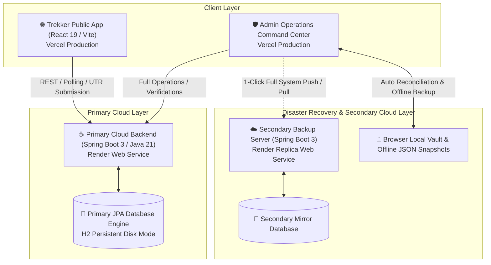

# 🚩 Shivchhatra Trekkers (शिवछत्र ट्रेकर्स)
### Enterprise Sahyadri Adventure, Heritage Fort Expeditions & Disaster Recovery Platform

[](https://spring.io/projects/spring-boot)
[](https://openjdk.org/)
[](https://react.dev/)
[](https://vitejs.dev/)
[](https://tailwindcss.com/)
[](https://www.docker.com/)
[](LICENSE)

> *"Every stone in the Sahyadris echoes with the courage of Hindavi Swarajya."*  
> **Shivchhatra Trekkers** is a full-stack, enterprise-grade expedition booking, fortress heritage encyclopedic guide, operations auditor, and dual-cloud disaster recovery platform designed for Sahyadri trekking organizers, fortress heritage enthusiasts, and adventure communities.

---

## 🏛️ System Architecture



---

## ✨ Core Platform Modules

### 1. 🌐 Public Trekker Web Application
- **Interactive Expedition Discovery**: Filter Sahyadri treks by Category (*Heritage, Monsoon, Night Trek, Thrill*), Difficulty (*Easy, Moderate, Hard*), Region, and Budget.
- **Batch Schedule & Capacity Trackers**: Real-time batch dates, seat availability trackers, pickup locations (Pune / Mumbai / Nashik).
- **Shivkalin Sacred Forts Heritage Guide**: Interactive encyclopedic showcase covering iconic Maratha forts (*Rajgad, Raigad, Torna, Harishchandragad, Sinhagad, Harihar, Pratapgad, Panhala, Salher*).
- **Direct UPI QR Instant Booking**:
  - Auto-generated dynamic UPI QR codes and official Merchant Scanner.
  - 12-digit UTR bank reference verification with receipt image upload validator.
  - Multi-passenger squad registration with emergency contact & pickup coordinates.
- **Live Boarding Pass & Expedition Tracker (`/track`)**:
  - Query by Booking Reference ID (`ST-2026-XXXX`), Phone Number, or 12-digit UTR.
  - Real-time status polling (updates live to 🟢 **Payment Verified & Confirmed** upon admin approval).
  - One-click **Printable Boarding Pass** and WhatsApp Expedition Lead integration.
- **Unfiltered Trail Moments Gallery**: High-resolution trail moments, summit views, and camping captures.
- **Community Ratings & Review Modal**: Trekker verified reviews, 5-star ratings, and aggregated score badges.

---

### 2. 🛡️ Standalone Admin Command Hub
- **Treks & Batches Catalog Manager**:
  - Add, edit, archive, and delete treks.
  - Full batch date scheduler, pricing configurator, elevation/duration editor, and photo manager.
- **Bookings & Payments Auditor**:
  - View all incoming expedition registrations and payment receipts.
  - 1-click **Verify Booking** (confirms seat and notifies public pass tracker) or **Reject** (frees up batch capacity).
  - **🚩 Expedition Completed Action**: Safely archives summited adventurers into the permanent lifetime history vault with zero data loss.
  - Full passenger squad roster inspection and CSV/Print exports.
- **🛡️ Enterprise Dual-Cloud Disaster Recovery Engine**:
  - 🚀 **`Push Full System to 2nd Server`**: Replicates all 6 modules (Treks, Bookings, Reviews, Payment Configs, Forts, Gallery) to the secondary Render backend with one click.
  - 🔄 **`Restore Full System from 2nd Server`**: 1-click cloud-to-cloud restoration.
  - 🗄️ **`Lock Full Snapshot`**: Instant offline local browser vault lock.
  - 💾 **`Export Full Backup (.json)`**: Downloads a complete timestamped backup snapshot to your computer/phone.
  - 📥 **`Import Full System File`**: 1-click restoration from any JSON backup file.
- **Unfiltered Trail Moments Gallery Manager**:
  - Upload photos, edit captions & fort locations with the **✏️ Edit Info Modal**, and manage trail moments.
- **Sacred Forts Heritage Manager**:
  - Edit Marathi titles, historical narratives, battle lore quotes, elevations, and bastions.
- **Payment Gateway Configurator**:
  - Live merchant UPI ID, Account Holder, Bank details, and Custom QR scanner management.

---

### 3. ☕ Spring Boot Enterprise Backend
- Built on **Java 21 LTS** and **Spring Boot 3.3.3**.
- **Spring Data JPA & Hibernate 6** with disk-persisted database storage.
- `@Lob CLOB` support for handling up to 50MB base64 images and large file payloads.
- High-precedence CORS configuration supporting multi-domain production environments.
- High-capacity rate limiting for cellular network pools (600 req/min).
- Atomic bulk sync endpoints (`/api/admin/system/full-export`, `/api/admin/system/full-import`, `/api/admin/bookings/bulk-sync`).

---

## 🛠️ Technology Stack

| Layer | Technologies |
|---|---|
| **Frontend (Public Client)** | React 19, Vite 8, Tailwind CSS, Framer Motion, Lucide React |
| **Frontend (Admin Portal)** | React 19, Vite 8, Tailwind CSS, Framer Motion, Lucide React |
| **Backend API** | Java 21, Spring Boot 3.3.3, Spring Data JPA, Hibernate, Maven |
| **Database & ORM** | H2 Embedded Database (Disk Mode), Hibernate ORM |
| **Containerization & CI/CD** | Multi-Stage Dockerfile, Eclipse Temurin 21 JRE, Git |
| **Deployment Targets** | Vercel (Frontends) + Render (Primary & Secondary Web Services) |

---

## 📁 Project Structure

```text
shivchhatra-trekkers/
├── backend/                               # Spring Boot 3 Java 21 Backend
│   ├── src/main/java/com/shivchhatra/
│   │   ├── config/                        # CORS, WebConfig, RateLimiting
│   │   ├── controller/                    # REST API (Trek, Booking, Fort, Gallery, SystemBackup)
│   │   ├── model/                         # JPA Entities (Trek, Booking, FortHeritage, Review, etc.)
│   │   └── repository/                    # Spring Data JPA Repositories
│   ├── src/main/resources/
│   │   └── application.properties         # Server & JPA configs
│   ├── data/                              # Persistent database storage (gitignored)
│   └── pom.xml                            # Maven dependencies & build configuration
│
├── shivchhatra-trekkers/                  # Public Web Application
│   ├── src/
│   │   ├── components/                    # Home, Trek, Fort, Booking, Review components
│   │   ├── context/                       # TrekContext, BookingContext, ReviewContext
│   │   ├── pages/                         # HomePage, TreksCatalog, FortGuide, BookingTrack
│   │   ├── services/                      # apiService.js (REST client & server sync)
│   │   └── App.jsx                        # Routing & Global Modals
│   ├── package.json
│   └── vite.config.js
│
├── admin-portal/                          # Admin Command Hub
│   ├── src/
│   │   ├── components/admin/              # TrekManager, BookingsAuditor, GalleryManager, etc.
│   │   ├── services/                      # api.js (Disaster Recovery & Admin REST Client)
│   │   └── App.jsx                        # Operations tabs & Admin security gate
│   ├── package.json
│   └── vite.config.js
│
├── Dockerfile                             # Root Multi-Stage Docker build for Render
├── package.json                           # Root scripts to build and run all services
└── README.md                              # Enterprise project documentation
```

---

## 🚀 Getting Started & Local Setup

### 📋 Prerequisites
- **Java 21 JDK** (`java -version`)
- **Apache Maven 3.9+** (`mvn -version`)
- **Node.js 18+ & npm** (`node -v` and `npm -v`)
- **Git** (`git --version`)

---

### 1️⃣ Clone the Repository
```bash
git clone https://github.com/<your-username>/SHIVCHHATRA_TREKKERS.git
cd SHIVCHHATRA_TREKKERS
```

---

### 2️⃣ Install Dependencies
```bash
# Install Public Client dependencies
cd shivchhatra-trekkers && npm install && cd ..

# Install Admin Portal dependencies
cd admin-portal && npm install && cd ..
```

---

### 3️⃣ Start the Backend
```bash
cd backend
mvn clean package -DskipTests
java -jar target/shivchhatra-backend-1.0.0.jar
```
> The Java backend will start on **`http://localhost:8080`** and initialize default records.

---

### 4️⃣ Start Frontend Applications

#### Terminal 1 — Public Client:
```bash
cd shivchhatra-trekkers
npm run dev
```
> Public Website live on **`http://localhost:5173`**

#### Terminal 2 — Admin Command Hub:
```bash
cd admin-portal
npm run dev
```
> Admin Portal live on **`http://localhost:5174`**

---

## ☁️ Production Deployment Guide

### 🐳 Deploying Backend on Render (Primary & Secondary Services)
1. In Render, select **New Web Service** -> Connect your GitHub repo.
2. Set Environment to **Docker** (Render will use the root `Dockerfile`).
3. Set **Environment Variables**:
   - `PORT` = `8080`
   - `JAVA_TOOL_OPTIONS` = `-Xmx450m`
4. Set Web Service Name:
   - Primary: `shivchhatra-trekkers-backend`
   - Secondary Disaster Recovery: `shivchhatra-backup-server`

---

### ⚡ Deploying Frontends on Vercel
1. **Public Portal (`shivchhatra-trekkers`)**:
   - Root Directory: `shivchhatra-trekkers`
   - Build Command: `npm run build`
   - Output Directory: `dist`
   - Environment Variables: `VITE_API_URL` = `https://<your-primary-backend>.onrender.com/api`
2. **Admin Command Hub (`admin-portal`)**:
   - Root Directory: `admin-portal`
   - Build Command: `npm run build`
   - Output Directory: `dist`
   - Environment Variables: `VITE_API_URL` = `https://<your-primary-backend>.onrender.com/api`

---

## 📡 Core API Endpoints

### 🏔️ Treks & Expeditions
- `GET /api/treks` — Retrieve all active treks & batch dates
- `POST /api/admin/treks` — Create a new trek expedition
- `PUT /api/admin/treks/{id}` — Update trek information & batches
- `DELETE /api/admin/treks/{id}` — Delete a trek

### 🎫 Bookings & Pass Tracker
- `GET /api/bookings/track?query={id_or_phone_or_utr}` — Query booking status & boarding pass
- `POST /api/bookings` — Submit a new expedition booking
- `GET /api/bookings/stats` — Real-time dynamic stats counter
- `GET /api/admin/bookings` — List all customer bookings for auditor
- `PUT /api/admin/bookings/{id}/verify` — Verify bank UTR & confirm booking
- `PUT /api/admin/bookings/{id}/complete` — Mark completed & archive to lifetime history
- `PUT /api/admin/bookings/{id}/reject` — Flag or reject invalid booking
- `DELETE /api/admin/bookings/{id}` — Idempotent delete booking record
- `POST /api/admin/bookings/bulk-sync` — Bulk reconcile bookings to database

### 🛡️ Disaster Recovery & System Replication
- `GET /api/admin/system/full-export` — Snapshot dump of all 6 platform modules
- `POST /api/admin/system/full-import` — Atomic import & replication of full database snapshot

### 🏰 Fort Heritage
- `GET /api/forts` — List all 9 sacred historical forts
- `POST /api/admin/forts` — Add a new fortress entry
- `PUT /api/admin/forts/{id}` — Update fort history, elevation, or bastions
- `DELETE /api/admin/forts/{id}` — Remove fort entry

### 📸 Trail Moments Gallery
- `GET /api/gallery` — Get live Trail Moments photos
- `POST /api/admin/gallery` — Upload a new trail photo moment
- `PUT /api/admin/gallery/{id}` — Edit photo caption, location, or image URL
- `DELETE /api/admin/gallery/{id}` — Remove a gallery photo

### ⭐ Trekker Reviews
- `GET /api/reviews` — Get verified customer reviews
- `POST /api/reviews` — Submit a review and rating
- `DELETE /api/admin/reviews/{id}` — Delete a review

### 🏦 Payment Configuration
- `GET /api/payment-config` — Public merchant UPI & scanner config
- `GET /api/admin/payment-config` — Admin gateway settings
- `PUT /api/admin/payment-config` — Update merchant UPI & banking settings

---

## 🚩 Swarajya Tribute & Ethics

> **छत्रपती शिवाजी महाराज की जय!**  
> All historical references, fortress data, and expedition guidelines are curated with the utmost respect to the sacred heritage of Chhatrapati Shivaji Maharaj and the Sahyadri mountains.

---

## 📄 License
This project is licensed under the MIT License — see the [LICENSE](LICENSE) file for details.
