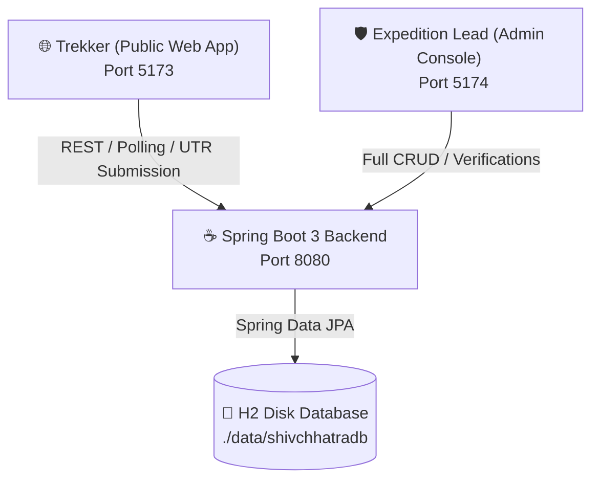

# 🚩 Shivchhatra Trekkers (शिवछत्र ट्रेकर्स)
### Enterprise Sahyadri Adventure & Heritage Fort Expeditions Platform

[](https://spring.io/projects/spring-boot)
[](https://openjdk.org/)
[](https://react.dev/)
[](https://vitejs.dev/)
[](https://tailwindcss.com/)
[](http://www.h2database.com)
[](LICENSE)

> *"Every stone in the Sahyadris echoes with the courage of Hindavi Swarajya."*  
> **Shivchhatra Trekkers** is a full-stack, enterprise-grade expedition booking, heritage guide, and operations management platform designed for Sahyadri trekking organizers, fortress heritage enthusiasts, and adventure communities.

---

## 🏛️ System Architecture



---

## ✨ Key Features

### 1. 🌐 Public Trekker Web Application (`http://localhost:5173`)
- **Interactive Hero & Expedition Discovery**: Filter Sahyadri treks by Category (*Heritage, Monsoon, Night Trek, Thrill*), Difficulty (*Easy, Moderate, Hard*), Region, and Budget slider.
- **Batch Schedule & Seat Counters**: Real-time batch dates, seat availability trackers, pickup locations (Pune / Mumbai / Nashik).
- **Shivkalin Sacred Forts Heritage**: Interactive showcase and dedicated encyclopedic guide covering 9 iconic Maratha forts (*Rajgad, Raigad, Torna, Harishchandragad, Sinhagad, Harihar, Pratapgad, Panhala, Salher*).
- **Direct UPI QR Instant Booking**:
  - Auto-generated dynamic UPI QR codes and official Merchant Scanner for **`7447661921@hdfc`** (Ravindra Chavan).
  - 12-digit UTR bank reference verification with receipt upload validator.
  - Multi-passenger squad registration with emergency contact & pickup coordinates.
- **Live Boarding Pass & Expedition Tracker (`/track`)**:
  - Query by Booking Reference ID (`ST-2026-XXXX`), Phone Number, or 12-digit UTR.
  - Real-time 3-second status polling (updates live to 🟢 **Payment Verified & Confirmed** when admin approves).
  - One-click **Printable Boarding Pass** and WhatsApp Expedition Lead integration.
- **Certified Safety & Gear Checklist**: Interactive gear packing checker and safety protocols.
- **Community Ratings & Review Modal**: Trekker verified reviews, 5-star ratings, and aggregated score badges.

---

### 2. 🛡️ Standalone Admin Command Hub (`http://localhost:5174`)
- **Treks Catalog Manager**:
  - Add, edit, archive, and delete treks.
  - Full batch date scheduler, pricing configurator, elevation/duration editor, and photo manager.
- **Bookings & Payments Auditor**:
  - View all incoming expedition registrations and payment receipts.
  - 1-click **Verify Booking** (confirms seat and notifies public pass tracker) or **Reject** (frees up batch seats).
  - Full passenger squad roster inspection and CSV/Print exports.
- **Sacred Forts Heritage Manager**:
  - Edit Marathi titles, historical narratives, battle lore quotes, elevations, and bastions.
  - Add new forts or modify existing ones with real-time public synchronization.
- **Payment Gateway Configurator**:
  - Live UPI ID management (`7447661921@hdfc`), Account Holder, Bank Name, and Custom QR scanner uploader.
  - Promo code discounts system (*SWARAJYA10, GROUPTREK*).
- **Trail Moments Photo Gallery Manager**:
  - Upload genuine trekker photos, add captions, tag Sahyadri locations, and publish instantly.
- **Community Reviews Moderator**:
  - Live rating metric breakdown (5★ to 1★), delete spam, and moderate feedback.

---

### 3. ☕ Spring Boot Enterprise Backend (`http://localhost:8080`)
- Built on **Java 21 LTS** and **Spring Boot 3.3.3**.
- **Spring Data JPA & Hibernate 6** with disk-persisted **H2 Database** (`./data/shivchhatradb`).
- `@Lob CLOB` support for handling up to 50MB base64 images and large file payloads.
- RESTful API endpoints for Treks, Bookings, Forts, Gallery, Reviews, and Payment Settings.
- Embedded **H2 Web Console** (`/h2-console`) for direct SQL inspection.

---

## 🛠️ Technology Stack

| Layer | Technologies |
|---|---|
| **Frontend (Public Client)** | React 19, Vite 8, Tailwind CSS, Framer Motion, Lucide React |
| **Frontend (Admin Portal)** | React 19, Vite 8, Tailwind CSS, Lucide React |
| **Backend API** | Java 21, Spring Boot 3.3.3, Spring Web, Spring Data JPA |
| **Database & ORM** | H2 Embedded Database (Disk Mode), Hibernate ORM |
| **Build & Tooling** | Apache Maven 3.9+, Node.js 18+, npm |

---

## 📁 Project Structure

```text
shivchhatra-trekkers/
├── backend/                               # Spring Boot 3 Java 21 Backend
│   ├── src/main/java/com/shivchhatra/
│   │   ├── config/                        # CORS, WebConfig, DataInitializer
│   │   ├── controller/                    # REST API Controllers (Trek, Booking, Fort, Gallery, etc.)
│   │   ├── model/                         # JPA Entities (Trek, Booking, FortHeritage, Review, etc.)
│   │   └── repository/                    # Spring Data JPA Repositories
│   ├── src/main/resources/
│   │   └── application.properties         # Database, multipart, and server configs
│   ├── data/                              # Persistent H2 database storage (gitignored)
│   └── pom.xml                            # Maven dependencies & build configuration
│
├── shivchhatra-trekkers/                  # Public Web Application (Port 5173)
│   ├── src/
│   │   ├── components/                    # Home, Trek, Fort, Booking, Review components
│   │   ├── context/                       # TrekContext, BookingContext, ReviewContext, PaymentConfigContext
│   │   ├── data/                          # Fallback datasets (fortsGuide, initialTreks)
│   │   ├── pages/                         # HomePage, TreksCatalog, FortGuide, BookingTrack, Safety
│   │   ├── services/                      # apiService.js (REST client & server sync)
│   │   ├── App.jsx                        # Routing & Global Modals
│   │   └── main.jsx                       # Entrypoint with ErrorBoundary
│   ├── package.json
│   └── vite.config.js
│
├── admin-portal/                          # Standalone Admin Command Hub (Port 5174)
│   ├── src/
│   │   ├── components/admin/              # TrekManager, BookingManager, FortManager, GalleryManager, etc.
│   │   ├── services/                      # api.js (Admin REST Client)
│   │   ├── App.jsx                        # Tab navigation & Admin routing
│   │   └── main.jsx
│   ├── package.json
│   └── vite.config.js
│
├── .gitignore                             # Root git ignore rules
├── package.json                           # Root scripts to build and run all services
└── README.md                              # Enterprise project documentation
```

---

## 🚀 Getting Started & Setup

### 📋 Prerequisites
Ensure the following tools are installed on your machine:
- **Java 21 JDK** (Verify with `java -version`)
- **Apache Maven** (Verify with `mvn -version`)
- **Node.js 18+ and npm** (Verify with `node -v` and `npm -v`)
- **Git** (Verify with `git --version`)

---

### 1️⃣ Clone the Repository
```bash
git clone https://github.com/your-username/shivchhatra-trekkers.git
cd shivchhatra-trekkers
```

---

### 2️⃣ Install Dependencies
```bash
# Install root orchestration dependencies
npm install

# Install Public Client dependencies
cd shivchhatra-trekkers && npm install && cd ..

# Install Admin Portal dependencies
cd admin-portal && npm install && cd ..
```

---

### 3️⃣ Build & Start the Backend
```bash
cd backend
mvn clean package -DskipTests
java -jar target/shivchhatra-backend-1.0.0.jar
```
> The Java backend will start on **`http://localhost:8080`** and automatically seed default fort heritage records and payment configuration.

---

### 4️⃣ Start Frontend Applications

#### Terminal 1 — Public Client:
```bash
cd shivchhatra-trekkers
npm run dev
```
> Public Website will be live on **`http://localhost:5173`**

#### Terminal 2 — Admin Command Hub:
```bash
cd admin-portal
npm run dev
```
> Admin Portal will be live on **`http://localhost:5174`**

---

## 🌐 Network Ports & Endpoints

| Service | URL | Purpose |
|---|---|---|
| **Public Website** | `http://localhost:5173` | Trek exploration, fort heritage, bookings, pass tracker |
| **Admin Portal** | `http://localhost:5174` | Full management console (Treks, Bookings, Forts, Gallery, Reviews) |
| **Spring Boot REST API** | `http://localhost:8080/api` | Enterprise REST endpoints |
| **H2 Web Console** | `http://localhost:8080/h2-console` | Direct database SQL browser (`JDBC URL: jdbc:h2:file:./data/shivchhatradb`, `User: SA`, `Password: [empty]`) |

---

## 🔐 Default Admin Credentials

- **Username**: `admin`
- **Password**: `shivchhatra@2026`
- **Security Access Code**: `SHIVCHHATRA_ADMIN_SECURE_TOKEN_2026`

*(You can update or configure these credentials in `backend/src/main/resources/application.properties`)*

---

## 📡 Core API Endpoints

### 🏔️ Treks
- `GET /api/treks` — Retrieve all active treks & batch dates
- `POST /api/admin/treks` — Create a new trek expedition
- `PUT /api/admin/treks/{id}` — Update trek information & batches
- `DELETE /api/admin/treks/{id}` — Archive or delete a trek

### 🎫 Bookings & Pass Tracker
- `GET /api/bookings/track?query={id_or_phone_or_utr}` — Query booking status & boarding pass
- `POST /api/bookings` — Submit a new expedition booking
- `GET /api/admin/bookings` — List all customer bookings for auditor
- `PUT /api/admin/bookings/{id}/verify` — Verify bank UTR & confirm booking
- `PUT /api/admin/bookings/{id}/reject` — Flag or reject invalid booking

### 🏰 Fort Heritage
- `GET /api/forts` — List all 9 sacred historical forts
- `POST /api/admin/forts` — Add a new fortress entry
- `PUT /api/admin/forts/{id}` — Update fort history, elevation, or bastions
- `DELETE /api/admin/forts/{id}` — Remove fort entry

### 📸 Gallery & Reviews
- `GET /api/gallery` — Get live Trail Moments photos
- `POST /api/admin/gallery` — Upload a new trail photo moment
- `DELETE /api/admin/gallery/{id}` — Remove a gallery photo
- `GET /api/reviews` — Get verified customer reviews
- `POST /api/reviews` — Submit a review and rating

---

## 📦 Production Build

To produce optimized production builds for deployment:

```bash
# Build Java Backend JAR
cd backend && mvn clean package -DskipTests && cd ..

# Build Public Client static assets (to dist/)
cd shivchhatra-trekkers && npm run build && cd ..

# Build Admin Portal static assets (to dist/)
cd admin-portal && npm run build && cd ..
```

---

## 🚩 Swarajya Tribute & Ethics

> **छत्रपती शिवाजी महाराज की जय!**  
> All historical references, fortress data, and expedition guidelines are curated with the utmost respect to the sacred heritage of Chhatrapati Shivaji Maharaj and the Sahyadri mountains.

---

## 📄 License
This project is licensed under the MIT License — see the [LICENSE](LICENSE) file for details.
